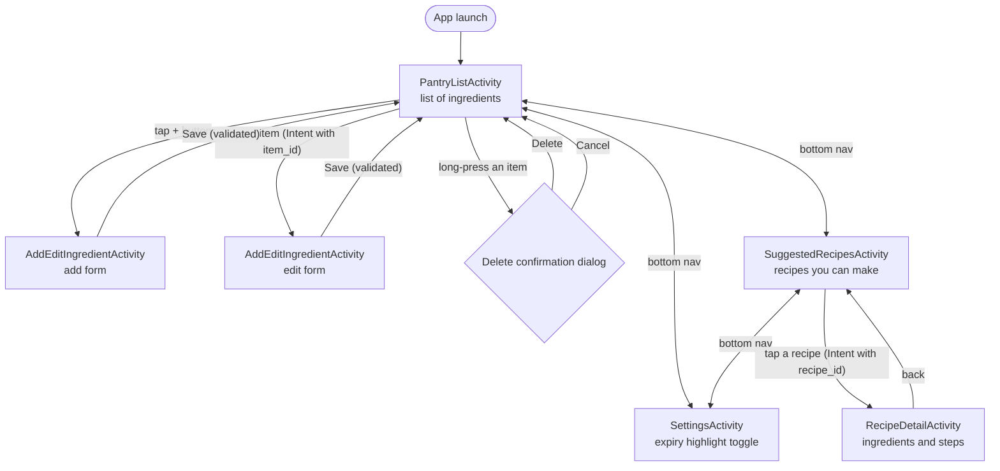

# Screen Flow Diagram

The three main screens (Pantry, Suggested, Settings) are linked by a bottom navigation bar. Screens are opened with Intents.

```mermaid
flowchart TD
    Start([App launch]) --> Pantry[PantryListActivity<br/>list of ingredients]

    Pantry -- "tap + button" --> AddEdit[AddEditIngredientActivity<br/>add form]
    Pantry -- "tap an item (Intent with item_id)" --> AddEdit2[AddEditIngredientActivity<br/>edit form]
    Pantry -- "long-press an item" --> Confirm{Delete confirmation dialog}
    Confirm -- "Delete" --> Pantry
    Confirm -- "Cancel" --> Pantry
    AddEdit -- "Save (validated)" --> Pantry
    AddEdit2 -- "Save (validated)" --> Pantry

    Pantry <-- "bottom nav" --> Suggested[SuggestedRecipesActivity<br/>recipes you can make]
    Pantry <-- "bottom nav" --> Settings[SettingsActivity<br/>expiry highlight toggle]
    Suggested <-- "bottom nav" --> Settings

    Suggested -- "tap a recipe (Intent with recipe_id)" --> Detail[RecipeDetailActivity<br/>ingredients and steps]
    Detail -- "back" --> Suggested
```
